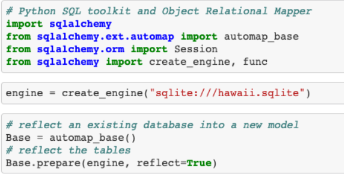
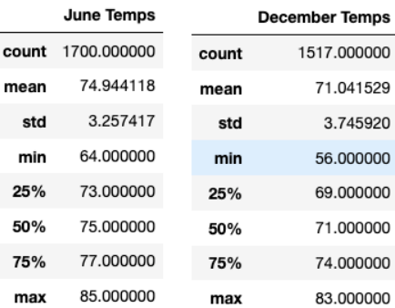

# Surfs_up

## Overview of Surfs Up Analysis

The goal of this analysis is to examine a weather dataset contained in a SQLite database in order to offer facts that will persuade an investor that constructing a Surf n' Shake shop in Oahu, Hawaii is a smart business concept. The plan is for the shop to sell surfboards and ice cream all year, but the investor is wary after investing in a similar venture that failed due to weather conditions. To persuade this investor, we'll need to give statistical analysis on Oahu's weather conditions that will persuade him that this will be a profitable business venture.

To explore the data in the SQLite database, we used SQLAlchemy to connect to it and generate queries to extract the information we needed for our research. We used Jupiter notebook to load dependencies and construct scripts to fetch data from the SQLite database throughout this module.

Below are the dependencies and functions that were used to access the content in the `SQLite` database:

In this analysis challenge, we were required to compare June and December data to describe summer and winter temperatures across a seven-year period. 

June and December experienced average temperatures of 75°F and 71°F, respectively, during this time period. The low temperature in June was 64°F and the high temperature was 85°F, while the low temperature in December was 56°F and the high temperature was 83°F. Furthermore, the standard deviations in June and December were nearly identical. The standard deviations of 3.26 in June and 3.75 in December indicate that their temperature records are centred around their respective average temperatures. Finally, the 75th percentile temperatures for June and December were 77°F and 74°F, respectively, indicating that these two months experienced moderately warm temperatures.

In addition, I would recommend further analysis on:
* Precipitation will be monitored for quantity and frequency between June and December to see if precipitation plays a role despite the warm temperatures.
* Elevation to compare and monitor in different parts of Oahu to see if one location's elevation attracts or repels business more than another.
* During the months of June and December, compare elevation to temperature and precipitation to see if these factors combined contribute to business.